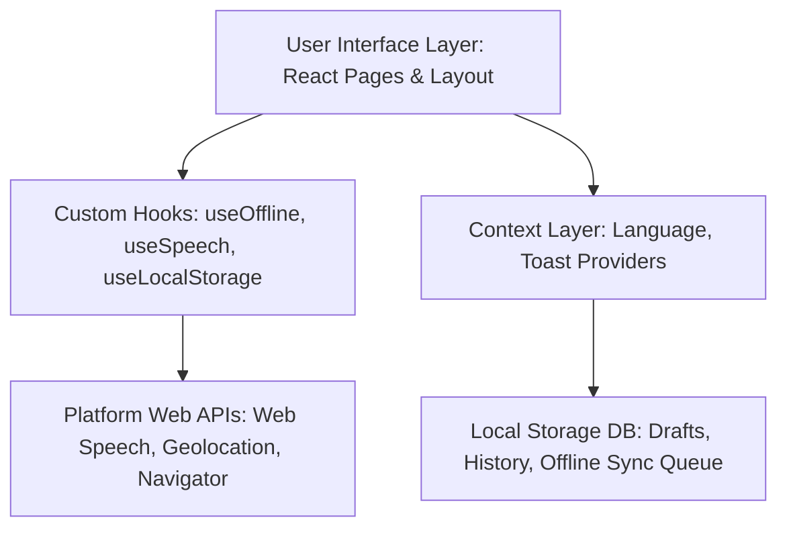
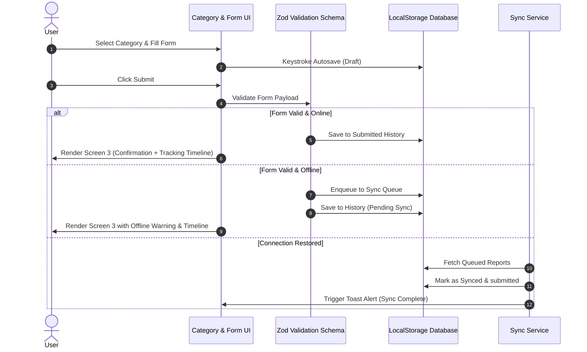

# CivicConnect - Multilingual Civic Issue Reporting PWA

CivicConnect is a production-quality, mobile-first Progressive Web Application (PWA) designed to report localized civic issues. Engineered with React, TypeScript, Tailwind CSS, and Framer Motion, it focuses on premium digital aesthetics, strict accessibility standards (WCAG 2.1 AA), and robust offline-first functionality.

---

## 🏛️ System Architecture

CivicConnect utilizes a client-side, feature-driven architectural pattern where all business logic, local databases, validation schemas, and offline sync engines run entirely in the user's browser.

### Component Layer Architecture



---

## 🔄 State & Data Sync Flow

User submissions transition through localized validation, draft backups, and connection checking:



---

## 🎨 Design Philosophy & Tokens

Inspired by modern government digital portals and top-tier SaaS dashboards, CivicConnect aims to project **trust, simplicity, and speed**:
- **Design Tokens**: Centralized colors, sizing, elevation, and typography are defined in `tailwind.config.js` to ensure visual cohesion.
- **8-Point Spacing**: Everything (paddings, margins, grid gaps) aligns on an 8px grid (or 4px for micro-spacing) to create professional, predictable layouts.
- **Calm Typography**: Restrained hierarchy standardizing on **Inter** and **Manrope**, restricted to no more than 5 distinct font sizes.
- **Muted Colors**: Slate base, deep slate blue primary, emerald accent for positive completion states, amber warning alerts, and red restricted solely to destructive deletions.

---

## 📱 Mobile-First & Progressive Enhancement

CivicConnect is built mobile-first. In developing economies and municipal sectors, citizen reports are predominantly filed on mobile devices on-the-go.
- **Viewport Layout**: Fixed margins, touch-friendly grid lists, and bottom bounds optimized for iOS Safari and Android Chrome.
- **Touch Targets**: 44px minimum sizing for all clickables, inputs, and actions.
- **Progressive Enhancement**: Core report filing is fully accessible even on legacy web platforms. If the **Web Speech API** is missing, the microphone interface falls back gracefully to standard keyboard text entry. If browser **Geolocation** permission is denied, manual location entry is offered instead.

---

## 🗣️ Marathi Localization Integration

Marathi (मराठी) was selected as the secondary language to represent regional municipal localization requirements (supporting the state of Maharashtra, India).
- **Static Translation Keys**: Managed in a single locale resource map (`translations.ts`).
- **Context Swapping**: Handled via `LanguageContext` which updates the HTML `lang` element dynamically to support screen readers and SEO crawlers without triggering full page reloads.

---

## ⚡ Performance Strategies

To survive extreme low-bandwidth connections (Slow 3G) and provide near-instant Time-To-Interactive (TTI):
1. **Client-Side Image Compression**: Utilizing HTML5 Canvas inside `UploadCard.tsx` to downscale captured camera files to a maximum dimension of 850px at 0.75 JPEG quality. This shrinks 5MB uploads to ~40KB base64 strings, preserving LocalStorage quotas and permitting swift uploads.
2. **Bundle Code Splitting**: Non-essential features (like success animations and detail forms) are dynamically split and lazy-loaded.
3. **SVG Icons**: Exclusively uses outline SVG vector icons from `react-icons` to minimize bundle bloat.
4. **Service Worker Pre-caching**: Vite PWA caches all essential CSS, JS, and local fonts on installation, facilitating offline startup.

---

## ♿ Accessibility (WCAG 2.1 AA)

- **Semantic Markup**: Standard elements (`header`, `main`, `footer`, `section`, `button`, `label`) are structured semantically.
- **Focus Rings**: Standardized high-contrast, outline-ring overrides (`focus-visible:ring-2 focus-visible:ring-brand-blue-800`) are active globally.
- **Aria Roles**: Live region announcements (`role="status"` or `role="alert"`) are configured on dynamic Toast messages. Categories support `role="radio"` with keyboard arrow/tab listeners.

---

## 🏗️ Folder Structure

```
src/
├── assets/             # SVG graphics (success illustration)
├── components/         # Reusable presentation components
│   ├── Button.tsx      # Multi-variant, loading-state button
│   ├── Card.tsx        # Keyboard-navigable selection cards
│   ├── Input.tsx       # Accessible text inputs with error bounds
│   ├── Textarea.tsx    # Auto-counting textareas
│   ├── VoiceButton.tsx # Dictation controls
│   ├── UploadCard.tsx  # Photo drag-and-drop compressor
│   ├── LanguageSwitch.tsx
│   ├── ProgressIndicator.tsx
│   ├── Toast.tsx       # Live status toaster
│   ├── Modal.tsx       # Keyboard-trapped popup dialogs
│   ├── SkeletonLoader.tsx
│   ├── StatusBadge.tsx
│   └── Header.tsx
├── features/
│   ├── issue/          # Issue reporting steps
│   │   ├── CategorySelection.tsx
│   │   ├── IssueDetailsForm.tsx
│   │   ├── ConfirmationScreen.tsx
│   │   └── SubmissionTimeline.tsx
│   └── language/       # Localization resources
│       ├── LanguageContext.tsx
│       └── translations.ts
├── hooks/              # Custom hooks (Offline, Speech, Caching)
│   ├── useOffline.ts
│   ├── useSpeechRecognition.ts
│   └── useLocalStorage.ts
├── layout/
│   └── MainLayout.tsx  # Shell layout + offline alerts
├── pages/
│   └── CivicConnectApp.tsx # Wizards state coordinator
├── types/
│   └── index.ts        # TypeScript schemas
├── utils/
│   └── helpers.ts      # UUID and Canvas compression helpers
└── constants/
    └── index.ts        # Data dictionaries
```

---

## ⚙️ How to Run & Build

To launch the project locally:
```bash
# Install dependencies
npm install

# Run asset generation (creates PWA icons and SVGs)
node generate_pwa_assets.js

# Start local development server
npm run dev

# Run production build and generate service workers
npm run build

# Preview production build locally
npm run preview
```
