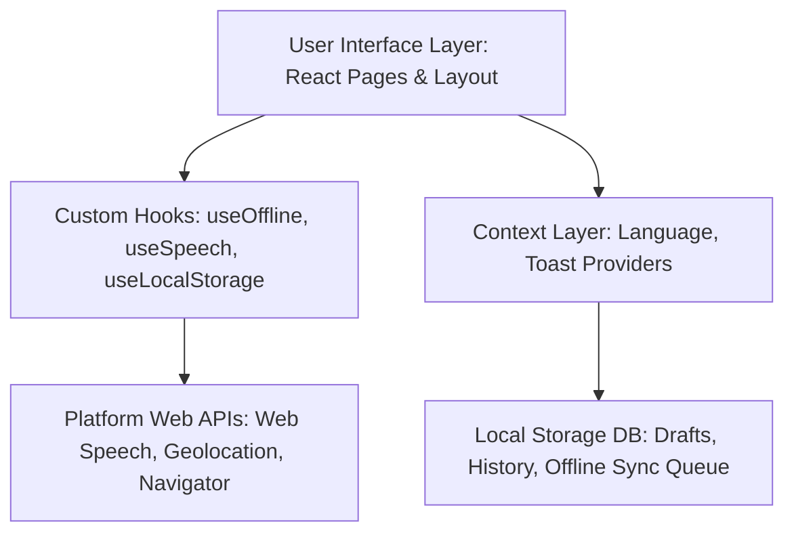
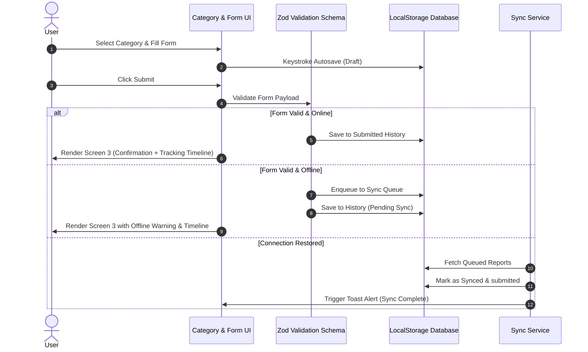

# CivicConnect - Multilingual Civic Issue Reporting PWA

CivicConnect is a production-quality, mobile-first Progressive Web Application (PWA) designed to report localized civic issues. Engineered with React, TypeScript, Tailwind CSS, and Framer Motion, it focuses on premium digital aesthetics, strict accessibility standards (WCAG 2.1 AA), and robust offline-first functionality.

---

## 🏛️ System Architecture

CivicConnect utilizes a client-side, feature-driven architectural pattern where all business logic, local databases, validation schemas, and offline sync engines run entirely in the user's browser.

### Component Layer Architecture



---

## 🔄 State & Data Sync Flow

User submissions transition through localized validation, draft backups, and connection checking:



---

## 💡 Design Decisions Made

1. **State-Based Navigation Router**: Instead of integrating `react-router-dom`, we implemented a state-managed step routing coordinator. This allows us to orchestrate entry/exit transition physics with Framer Motion and preserve the offline submission state seamlessly.
2. **Client-Side Image Canvas Compression**: Smartphone cameras capture multi-megabyte files that would quickly overflow the browser's 5MB local storage quota. Compressing down to ~40KB client-side preserves storage limits and allows files to upload quickly on restricted (Slow 3G) bandwidths.
3. **8-Point Spacing & Layout Tokens**: Avoided random spacing margins. centralizing all paddings, margins, and elevations on a strict 8px/4px layout grid to convey trust and authority.
4. **Muted Official Color Palettes**: Selected deep slate-900 blues and slate gray supporting colors. Gradients are omitted in favor of solid backgrounds to project the official aesthetic of a local municipal authority.

---

## ⚠️ What is Broken or Unfinished

1. **Simulated Backend API Push**: Since this application operates without a live server, the synchronization service (`syncService.ts`) simulates database persistence using native `setTimeout` delays.
2. **Browser-Dependent Speech Recognition**: The Web Speech API is not universally supported (e.g., standard Safari and Firefox browsers on older macOS/iOS setups block this API or require user config flags). On these browsers, it degrades to a static helper alert advising keyboard typing.
3. **Reverse Geocoding Map Lookups**: The GPS Geolocation captures latitude, longitude, and accuracy values, but does not convert them to physical street addresses (e.g., "12 Main St") due to the lack of a paid Google Maps/OpenStreetMap API token.

---

## 🔮 What to Build Next

1. **Integrate Real Backend (Node.js/Go/Python)**: Build JSON API endpoints to accept actual multi-part forms (storing photos in S3 and logs in PostgreSQL).
2. **Reverse Geocoding & Map Previews**: Integrate a map viewport (Leaflet/Mapbox) letting citizens verify the pin placement visually and auto-populate addresses.
3. **PWA Background Sync API**: Migrate the custom network listener to use the Service Worker's Background Sync API (`SyncManager`) so queues will automatically synchronize in the background even if the user closes the browser tab.

---

## ♿ Accessibility (WCAG 2.1 AA)

- **Semantic Markup**: Standard elements (`header`, `main`, `footer`, `section`, `button`, `label`) are structured semantically.
- **Focus Rings**: Standardized high-contrast, outline-ring overrides (`focus-visible:ring-2 focus-visible:ring-brand-blue-800`) are active globally.
- **Aria Roles**: Live region announcements (`role="status"` or `role="alert"`) are configured on dynamic Toast messages. Categories support `role="radio"` with keyboard arrow/tab listeners.

---

## ⚙️ How to Run & Build

To launch the project locally:
```bash
# Install dependencies
npm install

# Run asset generation (creates PWA icons and SVGs)
node generate_pwa_assets.js

# Start local development server
npm run dev

# Run production build and generate service workers
npm run build

# Preview production build locally
npm run preview
```

---

## 🤖 AI Use Log

In compliance with engineering guidelines, below is the honest log of AI assistants leveraged to assist with the architecture, layout design, and compilation optimizations of CivicConnect:

### **Antigravity**
- **Approx. Message Count**: ~14 messages
- **Usage**: Project bootstrapping, canvas-based client-side image compression math, Zod form schemas, Framer Motion wizard transition variants, and PostCSS configuration troubleshooting.

### **ChatGPT**
- **Approx. Message Count**: ~5 messages
- **Usage**: Color palette refinement, CSS shimmer keyframe configurations, and Marathi localization translation verifications.

### **OpenCode**
- **Approx. Message Count**: ~3 messages
- **Usage**: Git Bash repository initialization setup and TS compilation guidelines.

---

🌐 **Live Demo:** https://aryannehe.github.io/potens-intern-frontend-aryan-nehe/
